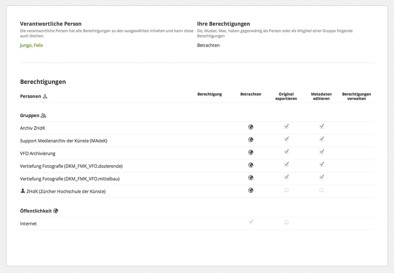

## Leitfaden für die Eingabe von Abschlussarbeiten

Das Medienarchiv ist ein wichtiges Instrument, um Abschlussarbeiten für ein breites Publikum sichtbar zu machen. Darüber hinaus stellt es den ersten Schritt für die Archivierung von Bachelor- und Masterabschlüssen, von Nachdiplomen und Doktoraten dar. Für die Eingabe von Abschlussarbeiten wurde ein Workflow entwickelt.

### Beispiele

Abschlussarbeiten können je nach Disziplin, Ausbildungsrichtung und Lehrstufe unterschiedlich sein. Machen Sie sich als erstes mit ausgewählten Beispielen von Abschlussarbeiten vertraut.

* Diplomarbeit aus dem Bereich Fotografie  
<https://medienarchiv.zhdk.ch/sets/5589e487-e1c5-49a3-ab02-1f424c9c4426>
* Bachelorarbeit aus der Vertiefung Industrial Design  
<https://medienarchiv.zhdk.ch/sets/28c54a7f-b2af-4d26-a868-063cd8982497>
* Bachelorarbeit aus der Vertiefung  Scientific Visualization  
<https://medienarchiv.zhdk.ch/sets/schloss-hartenstein>

In der Regel bestehen Abschlussarbeiten aus unterschiedlichen Medien. Handelt es sich beispielsweise bei der Abschlussarbeit um eine Rauminstallation, so sind ein Film und einige Fotos einer darin inszenierten Performance, ein Textdokument und vielleicht noch einige Audiodateien Teil dieser umfassenden Abschlussarbeit. Die Abschlussarbeit besteht im Medienarchiv also aus einem Set, welches einzelne Medieneinträge beinhaltet.

### Vorbereitung

Vor der eigentlichen Eingabe von Abschlussarbeiten bzw. dem Import von Medien, gilt es nachfolgende Empfehlungen zu beachten.

#### Medien offline vorbereiten

Bei der Aufarbeitung von Medien auf dem eigenen Computer können neben der eigentlich Bearbeitung von Bildern, Tönen und Videos auch bereits Metadaten vergeben werden. In der professionellen Bildbearbeitung mit Programmen wie Photoshop oder Lightroom ist es üblich, Bilder bereits mit Abgaben zur Autorschaft, Nutzungsrechten usw. zu versehen. Madek versteht den Metadatenstandard IPTC/XMPcore und übernimmt entsprechende Informationen automatisch.

#### Wahl der richtigen Dateiformate

Insbesondere im Hinblick auf eine spätere Langzeitarchivierung durch das Archiv ZHdK, gilt es die richtigen Dateiformate zu wählen. Standardisierte und freie Formate von möglichst hoher Qualität sind dabei besonders erwünscht.

[Weitere Informationen zu Medientypen & Dateiformaten](/software/04-mediaentries#medientypen-dateiformate)

### Medien importieren und gruppieren

Das Importieren von Medien einer Abschlussarbeit entspricht dem allgemeinen [Medienimport](/software/04-mediaentries#medien-importieren). Es ist sinnvoll Medien eines Projektes zusammen zu importieren und im Anschluss in projektspezifisches [Set](/software/05-organize#arbeiten-mit-sets) zu legen.

### Metadaten

Den Vorgaben bezüglich Metadaten für Abschlussarbeiten auf der Ebene von Sets und einzelner Medieneinträge ist möglichst präzise Folge zu leisten. Nachfolgende Metadaten gilt es für alle Medieneintrag anzugeben. Soweit die Angaben identisch sind, kann dies einfach mittels [Stapelverarbeitung](/software/05-organize#stapelverarbeitung) geschehen.

[Allgemeine Informationen zu Metadaten in Madek](/software/02-concepts#metadaten)

#### Sinn und Zweck von Metadaten

Sowohl für die rasche Auffindbarkeit als auch für die spätere Langzeitarchivierung der Abschlussarbeiten ist die Vergabe von Metadaten von grosser Bedeutung. Für Abschlussarbeiten wurden aus diesem Grund spezifische Vorgaben über verschiedene Metadatenkontexte hinweg definiert.

#### ZHdK

* __Bereich ZHdK__: Vertiefungsrichtung und/oder Departement
* __Typ__: "Abschlussarbeit"
* __Studienabschnitt__: Präzisierung des Abschlusstyps
* __Projekttitel__: Titel der Abschlussarbeit in voller Länge
* __Dozierende/Projektleitung__: Mentorinnen und Mentoren

#### Objekt

* __Titel__: Titel der Abschlussarbeit
* __Untertitel__: ergänzt den Titel mit einer zusätzlichen Präzisierung für den jeweiligen Medieneintrag
* __Datierung__: Zeitraum oder genauer Tag, an welchem die Arbeit entstanden ist oder aufgeführt wurde
* __Schlagworte__: Begriffe, welche die Arbeit genauer beschreiben und die nicht sinnvoller durch andere Felder wie Gattung, Autor/in usw. abgedeckt werden, also z.B. Themen der Arbeit
* __Kunstgattung / Disziplin__: Die Werk-Kategorie, zu welcher die Abschlussarbeit am ehesten zugeordnet werden kann
* __Beschreibung__: Ausführliche Beschreibung der Abschlussarbeit (kann ggf. auch auf dem bündelnden Set angegeben werden)

#### Personen

* __Autor/in__: Ersteller/in der Abschlussarbeit
* __Medienersteller/in__: Ersteller/in des dokumentierenden Medieneintrags. Kann sich vom Autor/von der der Autorin unterscheiden, wenn das hochgeladene Medium das Werk dokumentiert, etwa bei der Videoaufnahme einer Performance oder der Fotografie eines Objektes

#### Rechte

* __Rechteinhaber/in__: In der Regel die "Zürcher Hochschule der Künste" (bitte immer ausschreiben)
* __Beschreibung durch__: Name der Person, welche die Eingaben im Medienarchiv gemacht hat

[Weitere Informationen zur Eingabe von Metadaten](/software/04-mediaentries/#metadaten-editieren)

### Zugriffsberechtigungen

Für alle Abschlussarbeiten gilt, dass diese im Medienarchiv zumindest in einer kleinen Auflösung öffentlich sichtbar sein sollen. Hierfür müssen entsprechende Zugriffsberechtigungen eingestellt werden. Beachten Sie bitte, dass dieser Zugriff sowohl für das Set wie auch die darin enthaltenen Medieneinträge eingestellt werden muss.

In diesem Beispiel hat ein Student der Vertiefung Fotografie Dozierenden und Mitarbeitenden seiner eigenen Vertiefung, dem Archiv ZHdK und dem Support des Medienarchivs umfassende Berechtigungen gegeben, die einen Zugriff auf die Originaldateien und die Möglichkeit, Metadaten zu editieren, umfassen.

Die Öffentlichkeit kann den Medieneintrag sehen, aber lediglich als Vorschau mit geringer Auflösung. Bei PDF-Dateien ist zu beachten, dass diese nur betrachtet werden können, wenn man Zugriff auf das Original hat.

[Weitere Informationen zum Einstellen der Zugriffsberechtigungen](/software/04-mediaentries#zugriffsberechtigungen-bearbeiten)
