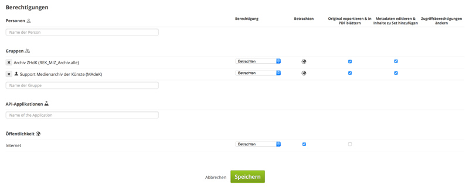
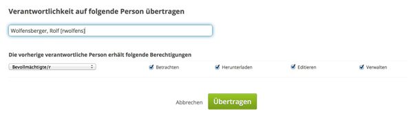

## Ablieferung an das Archiv ZHdK

Über das Medienarchiv können digitale Medien zum Zweck der Langzeitarchivierung an das Archiv der ZHdK abgeliefert werden. Für diese Prozesse ist das Archiv der ZHdK zuständig.

Rolf Wolfensberger  
[rolf.wolfensberger@zhdk.ch](mailto:rolf.wolfensberger@zhdk.ch)  
Telefon: +41 43 446 21 84

Allgemeine Informationen zur Archivierung an der ZHdK finden Sie hier:
<https://archivierung.zhdk.ch>

### Metadaten des Sets überarbeiten

Sobald nicht bereits geschehen, bündeln Sie Ihre Ablieferungen in projektspezifischen Sets. Überprüfen und vervollständigen Sie die Metadaten der Sets sowie der enthaltenen Medieneinträge.

### Zugriffsberechtigungen für Sets und Medieneinträge ergänzen

Vergeben Sie Zugriffsberechtigungen für Gruppen und Öffentlichkeit entsprechend der Policy ihrer Abteilung bzw. Studienvertiefung. Grundsätzlich sollen Abschlussarbeiten sowohl für die ZHdK als auch für die Öffentlichkeit freigeschaltet werden. Einzelne Abteilungen schalten jedoch nur die besten Abschlussarbeiten für die Öffentlichkeit frei. Auch Theoriearbeiten oder Konzepte für künstlerische Arbeiten können restriktivere Zugriffsberechtigungen haben.

Tragen Sie für Sets und Medieneinträge bei den Zugriffsberechtigungen das *Archiv ZHdK (REK_MIZ_Archiv.alle)* und den *Support Medienarchiv der Künste (Madek)* mit allen Rechten ein.

Tragen Sie auf der selben Seite Rolf Wolfensberger mittels der Funktion *Verantwortlichkeit übertragen* als verantwortliche Person ein.

### Einwurf in den Archiv-Briefkasten

Fügen Sie ihre Sets dem Archiv-Briefkasten-Set ["Abgabe ans Archiv ZHdK"](https://medienarchiv.zhdk.ch/sets/abgabe-ans-archiv) hinzu.