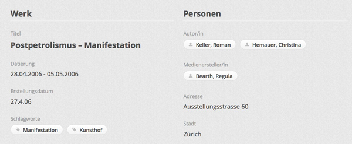

## Bilder offline vorbereiten

Das Medienarchiv importiert neben technischen EXIF-Daten auch inhaltliche Metadaten, wenn diese vorgängig in Bilder eingeschriebenen wurden. So bleiben bereits vergebenen Metadaten nach dem Import ins Medienarchiv erhalten. Dadurch wird die weit verbreitete Arbeitsweise einer individuellen Beschlagwortung von Bildern mit IPTC/XMP-Daten auf dem eigenen Rechner unterstützt. Nach dem Import ins Medienarchiv kann auf dem bereits erreichten Wissensstand weitergearbeitet werden. Auf diese Weise wird die Schwelle zwischen individuellem Arbeiten auf dem eigenen Rechner hin zum gemeinschaftlichen Arbeiten im Medienarchiv so niedrig wie möglich gehalten.

Ein typisches Szenario für diese Arbeitsform ist das gemeinsame Recherchieren von Bildmaterial in einer Arbeitsgruppe. In einem ersten Schritt tragen die einzelnen Mitglieder Materialien auf ihren eigenen Rechnern zusammen. Dort werden diese zum ersten Mal gruppiert, bewertet und mit Metadaten versehen. In einem zweiten Schritt importieren alle Mitglieder ihre Beispiele ins Medienarchiv und tragen gemeinsam zu einer umfangreicheren, wachsenden Sammlung bei, die von allen Beteiligten genutzt wird. Durch den Import der wichtigsten Metadaten kann dabei reibungslos an den Bildern weitergearbeitet werden.

### Autorschaft und Datierung

Da der Standard IPTC/XMPcore aus dem Kontext der Pressefotografie kommt, werden zwar Medienersteller/in resp. Fotograf/in und das Entstehungsdatum eines Fotos erfasst. Aber die in künstlerischen und gestalterischen Zusammenhängen notwendigen Angaben zur Autorschaft und Datierung sind nicht vorgesehen. Daher bieten wir einen für die ZHdK massgeschneiderten Katalog an, in dem die Felder Autor/in und Datierung bereits auf dem eigenen Computer eingegeben und anschliessend ins Medienarchiv importiert werden können. Siehe Link weiter unten.

* *Autor/in*: Ein Autor ist der Urheber eines Werkes, er hat die Rechte am geistigen Eigentum. Der Begriff der Autorschaft ist weit gefasst und wird im Medienarchiv angewendet auf einen Künstler, Designer, Erfinder und Urheber.

* *Medienersteller/in*: Eine Person, die z.B. im Rahmen ihrer Lehrtätigkeit die Fotografie einer Ausstellung von studentischen Werken gemacht hat. Die Fotografie hat dokumentarische Absichten und darauf sind die Werke anderer Personen abgebildet.

* *Datierung*: Eine Angabe zum Zeitpunkt, an dem das abgebildete Werk entstanden ist.

* *Erstellungsdatum*: Das Datum, an dem das abbildende Medium (z.B. die Fotografie oder die Audio-Aufnahme) entstanden ist. Die Datierung und das Erstelldatum können verschieden sein.

Dieses Bildschirmfoto zeigt als Beispiel einen Medieneintrag, der sich auf eine künstlerische Aktion bezieht, die vom 28.04.2006 - 05.05.2006 (Datierung) stattgefunden hat. Der auf der Fotografie abgebildete Vortrag wurde am 27.04.06 (Erstellungsdatum) auf der Vernissage gehalten. Die Künstler/innen sind Roman Keller und Christina Hemauer (Autor/in). Die Fotografie wurde gemacht von Regula Bearth (Medienersteller/in).  
<https://medienarchiv.zhdk.ch/entries/f9725c56-6bbd-4cb8-959f-1082b811d456>

### Empfohlene Arbeitsabläufe

Wir empfehlen für einen einfachen Arbeitsablauf das Programm *Media Pro* zu verwenden. Es unterstützt die an der ZHdK üblichen Abläufe am optimalsten.

1. Installieren Sie das Programm auf Ihrem Computer. Für Mitarbeitende an der ZHdK bietet das ITZ eine beschränkte Anzahl an Lizenzen an.
2. Laden Sie aus dem Medienarchiv einen vorbereiteten Media-Pro-Katalog herunter. Ein aktueller Katalog befindet sich im Set <https://medienarchiv.zhdk.ch/sets/vorlagen_offline_vorbereiten>.
3. Duplizieren Sie den Katalog auf Ihrem Computer und öffnen Sie die Kopie. Im Katalog befindet sich ein Beispielbild, das mit den Titeln der Zielfelder im Medienarchiv beschlagwortet ist. Das Beispielbild zeigt an, wo die Metadaten in *Media Pro* eingefügt werden sollten, damit sie im Medienarchiv an der gewünschten Stelle landen. Das Beispielbild hilft die Titel der Zielfelder zu verstehen und zeigt auch zwei individuelle Felder (*Autor/in* und *Datierung*) an. Vorsicht: Lassen Sie das Beispielbild im Katalog liegen. Wird es entfernt, sind die Zielfelder im Medienarchiv nicht mehr sichtbar.
4. Ziehen Sie eigene Bilder via Drag and Drop in Ihren Katalog hinein. Nun können Sie diese sortieren und eine Auswahl fürs Medienarchiv treffen. Entfernen Sie die anderen Bilder aus dem Katalog – am besten, Sie löschen sie gleich.
5. Füllen Sie nun ausschliesslich die Felder aus, welche Ihnen der fürs Medienarchiv vorbereitete Media-Pro-Katalog anzeigt. Für genau diese Felder bieten wir eine Übertragung ins Medienarchiv an. Es werden nicht alle standardmässig angebotenen Felder unterstützt.
6. Nutzen Sie in *Media Pro* die vielfältigen Möglichkeiten der Stapelverarbeitung und Metadatenmasken.
7. Vergessen Sie nicht, zum Schluss die Metadaten in die Bild-Dateien hinein zu schreiben. Um dem Import zu vereinfachen, können sie die ausgewählten und beschlagworteten Bilder in Stapelverarbeitung umbenennen und möglichst in einen gemeinsamen Ordner legen.
8. Beim Importieren werden nun die bereits vergebenen Metadaten in die entsprechenden Felder des Medienarchivs übertragen.

### Beachten Sie folgende Punkte beim Arbeiten mit *Media Pro*

**Anzeige der Feldnamen**  
Wählen Sie: Einstellungen -> Allgemein -> Feldname: IPTC core

**Vorbereiten von Metadatenvorlagen**  
Wenn Sie immer wieder die gleichen Metadaten zu vergeben haben, dann eignen sich Metadatenvorlagen. Sie werden nicht in der Menüleiste des Programms erstellt sondern direkt im Katalog selbst: Wählen Sie hierzu das kleine Stift-Icon aus, das auf der linken Seite des Katalogs in der Leiste neben dem Titel des ausgewählten Bildes steht.

**Nicht vergessen: Metadaten in die Datei schreiben**  
Wählen Sie: Aktion -> Anmerkungen synchronisieren -> Anmerkungen in Originale exportieren. Dabei alle angebotenen Optionen wählen: "Eigene Felder einschliessen", "Katalogsätze einschliessen", "Hierarchische Schlüsselworte einschliessen" und "GPS-Felder einschliessen"

### Hilfsmittel zum Download aus dem Medienarchiv

<https://medienarchiv.zhdk.ch/sets/vorlagen_offline_vorbereiten>

Vorbereiter Medienarchiv-Katalog: enthält nur die von uns gemappten Metadatenfelder plus die beiden individuellen *Autor/in* und *Datierung*. Alle anderen sind ausgeblendet.

Beispielbild: Dort sind die Zielfelder im Medienarchiv in die Datei geschrieben. Dieses Bild kann auch in Programmen wie Bridge, Lightroom usw. geöffnet werden. Achtung dort werden die beiden Felder *Autor/in* und *Datierung* nicht unterstützt. Sie müssen dann später im Medienarchiv nachgetragen werden.