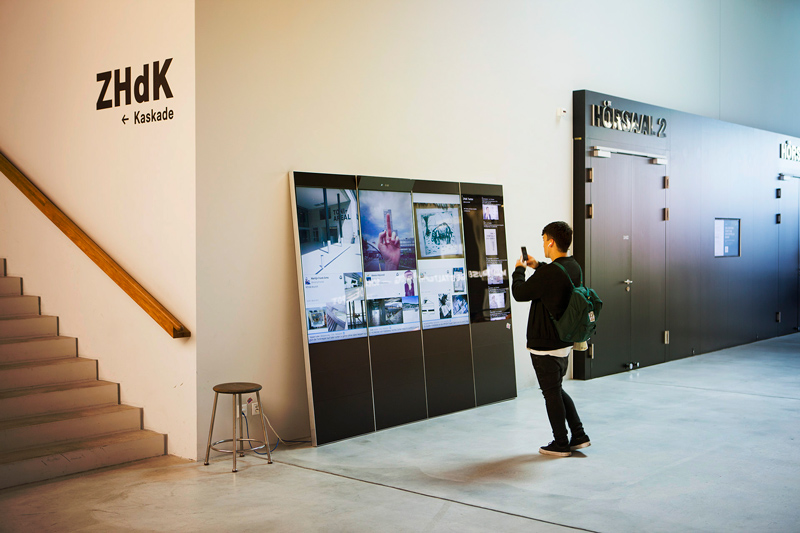
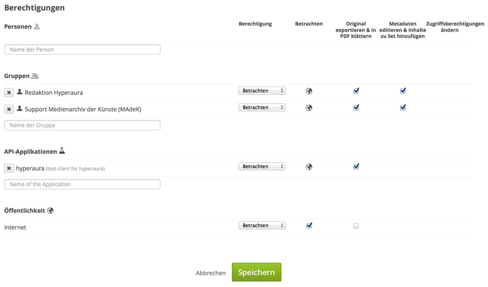

## Hyperaura

In der Eingangshalle des Toni-Areals stehen medial bespielbare Panels, die sogenannte Hyperaura. Alle Mitglieder der ZHdK können Bilder und Videos via Medienarchiv an die Hyperaura senden. Die Hyperaura besteht aus vier aneinandergefügten Panels; von diesen können die drei aufeinanderfolgenden auf der linken Seite angesteuert werden. Damit Sie ihre Inhalte auf der Hyperaura darstellen können, beachten Sie bitte folgende Punkte.

### Formate

Notwendig für die korrekte Wiedergabe der Inhalte ist die entsprechende Formatierung derselben. Tonausgabe wird nicht unterstützt. Es werden folgende Formate akzeptiert:

* *Bilder* - Format: jpg, Auflösung: 3240x1920 Pixel, 72 dpi, Farbraum: RGB
* *Filme* - Format: mp4(h264), Auflösung: 3240x1920 Pixel, Bildrate: 30fps

Bitte beachten Sie die Vorgabe für die Auflösung und passen Sie bestehende Bilder und Videos ggf. an. Abweichende Grössen werden ignoriert.

### Vorlagen

Es existieren Vorlagen für Keynote, Photoshop, InDesign sowie ein Preset für den Adobe Media Encoder. Diese Vorlagen sind im Medienarchiv für Sie bereitgestellt. Wählen Sie die passende Vorlage und exportieren diese auf Ihren persönlichen Computer:

* *Keynote*: <https://medienarchiv.zhdk.ch/entries/hyperaura_vorlage_keynote>
* *Keynote 09*: <https://medienarchiv.zhdk.ch/entries/hyperaura_vorlage_keynote_09>
* *Photoshop*: <https://medienarchiv.zhdk.ch/entries/hyperaura_vorlage_photoshop>
* *InDesign CC*: <https://medienarchiv.zhdk.ch/entries/hyperaura_vorlage_indesign_cc>
* *InDesign CS4*: <https://medienarchiv.zhdk.ch/entries/hyperaura_vorlage_indesign_cs4>
* *Adobe Media Encoder*: <https://medienarchiv.zhdk.ch/entries/hyperaura_media_encoder_preset>

### Bereitstellen via Medienarchiv

Damit Inhalte auf der Hyperaura angezeigt werden, müssen sie im Medienarchiv hinterlegt und mit den entsprechenden Rechten versehen werden. Die Hyperaura aktualisiert jeweils zur vollen Stunde die Inhalte. Um die Medien auf der Hyperaura abzuspielen, benötigt es drei Schritte:

* Importieren Sie die Datei ins Medienarchiv
* Geben Sie die Zugriffsberechtigungen für die Api-Applikation *hyperaura* frei ("Original exportieren") sowie für die Gruppen *Redaktion Hyperaura* und *Support Medienarchiv der Künste (Madek)*. Die Öffentlichkeit erhält die Berechtigung "Betrachten".
* Fügen Sie die Datei zum Set [*Inhalte Hyperaura*](https://medienarchiv.zhdk.ch/sets/inhalte_hyperaura) hinzu.

### Modalitäten beim Abspielen

Alle Inhalte im Set [*Inhalte Hyperaura*](https://medienarchiv.zhdk.ch/sets/inhalte_hyperaura) werden nacheinander wiedergegeben. Je mehr Inhalte vorhanden sind, desto länger kann es dauern, bis der eigene Inhalt erscheint.

### Einzelne Bilder

Bilder werden auf der Hyperaura nach dem Zufallsprinzip abgespielt. Für einzelne Bilder empfehlen wir die Verwendung der Vorlage für Photoshop oder InDesign. Die Anzeigendauer pro Bild beträgt 15 Sekunden.

### Bildabfolgen oder gemischte Formate

Will man mehrere Bilder als Slideshow abspielen, dann sollten diese mit einem Präsentationsprogramm wie Keynote oder PowerPoint in die gewünschte Reihenfolge gebracht werden. Am einfachsten arrangiert man alle Inhalte mit Hilfe der vorbereiteten Vorlage für Keynote. Die Keynote-Vorlage zeigt die Einteilung der Panels an. Will man verschiedene Formate wie Video, Text und Bilder mischen, geht das ebenfalls einfach mit der Keynote-Vorlage. Es sind auch Effekte wie Überblendungen usw. möglich. Zum Schluss exportiert man die Präsentation als Video mit den oben genannten Einstellungen.

### Videos

Videos werden in voller Länge von Anfang bis Ende wiedergegeben. Eine Tonausgabe ist nicht möglich. Für die Erstellung von Videos empfehlen wir die Verwendung der Vorlage für Keynote oder den Adobe Media Encoder.

### Entfernen der Inhalte

Um Inhalte von der Hyperaura zu entfernen, genügt es, die entsprechenden Inhalte aus dem Set [*Inhalte Hyperaura*](https://medienarchiv.zhdk.ch/sets/inhalte_hyperaura) zu entfernen.  
[Weitere Informationen zum Entfernen von Inhalten aus einem Set](/software/05-organize#arbeiten-mit-sets)

### Kontakt

Haben Sie Fragen zur Hyperaura, nehmen Sie Kontakt auf mit:  

Moritz Kemper, [moritz.kemper@zhdk.ch](mailto:moritz.kemper@zhdk.ch)  
Simon Pfaff, [simon.pfaff@zhdk.ch](mailto:simon.pfaff@zhdk.ch)
