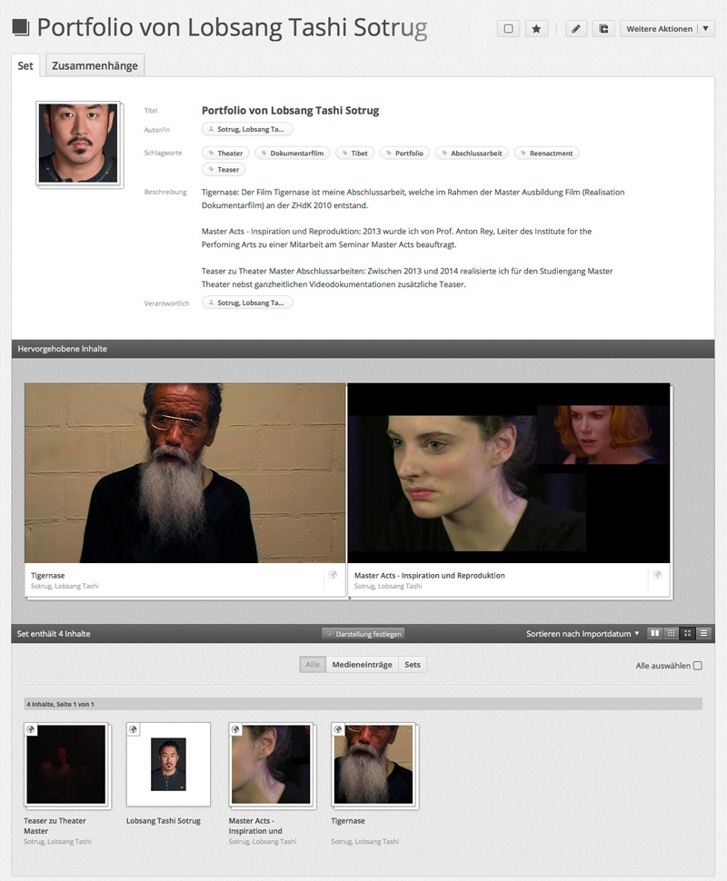

## Persönliches Portfolio

Während des Studiums entstehen verschiedene Arbeiten. Im Medienarchiv können Zwischenergebnisse, Dokumentationen und Abschlussarbeiten geordnet, geteilt und archiviert werden. Mit Hilfe eines persönlichen Portfolios können Sie ihre Resultate aus dem Studium oder der Projektarbeit sichtbar machen. Das Medienarchiv kann so als eine persönliche Präsentationsmappe verwendet werden.

### Geeignete Funktionen

Um ein persönliches Portfolio zu erstellen sind bestimmte Funktionen des Medienarchivs besonders geeignet: Beispielsweise können Sie ihre bereits vorhandene Medieneinträge in Sets gruppieren und auf diese Weise dem Portfolio beifügen. Durch Zugriffsberechtigungen können Sie entscheiden, welche ihrer Inhalte im Rahmen des Portfolios öffentlich sichtbar sind -- und welche Sie nur für sich selbst nutzen wollen. Icons wie die Weltkugel oder das Gruppensymbol machen die Zugriffsberechtigungen sichtbar. Sowohl ihre Inhalte wie auch die Zugriffsberechtigungen können Sie jederzeit anpassen. Bezüglich der Darstellung des Portfolios bietet das Medienarchiv verschiedene Optionen an. Sie können das Titelbild festlegen, attraktive Inhalte hervorheben und die Darstellung der Medien bestimmen. Es lohnt sich insbesondere für ein Portfolio eine sprechende Adresse zu vergeben.

### Beispiel für ein Portfolio

Lobsang Tashi Sotrug (Alumnus, MA Film) stellt sein Portfolio vor:  
"2010 schloss ich mein Master Filmstudium (Realisation Dokumentarfilm) an der ZHdK ab. Nach dem Studium arbeitete ich an einigen Seminaren der Hochschule mit und realisierte Stückdokumentationen für die Fachrichtung Theater. In meinem persönlichen Portfolio befinden sich Seminararbeiten aus der Forschung, dokumentarische Videos für das Theater und meine Abschlussarbeit in Form eines 52-minütigen Dokumentarfilms."

<https://medienarchiv.zhdk.ch/sets/portfolio_lobsang_tashi_sotrug>

### Schritt für Schritt zum eigenen Portfolio

Für die Erstellung eines Portfolios wenden Sie folgende Schritte an:

* [Medien importieren](/software/04-mediaentries#medien-importieren)
* [Metadaten editieren](/software/04-mediaentries#metadaten-editieren)
* [Medien gruppieren](/software/05-organize#arbeiten-mit-sets)
* [Zugriffsberechtigungen verwalten](/software/04-mediaentries#zugriffsberechtigungen-bearbeiten)
* [Set gestalten](/software/05-organize#darstellungsoptionen-von-sets)
* [Adresse anlegen](/software/05-organize#adressen-verwalten)
