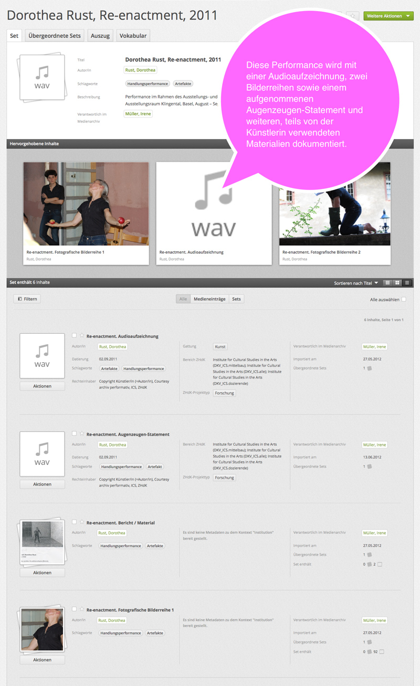
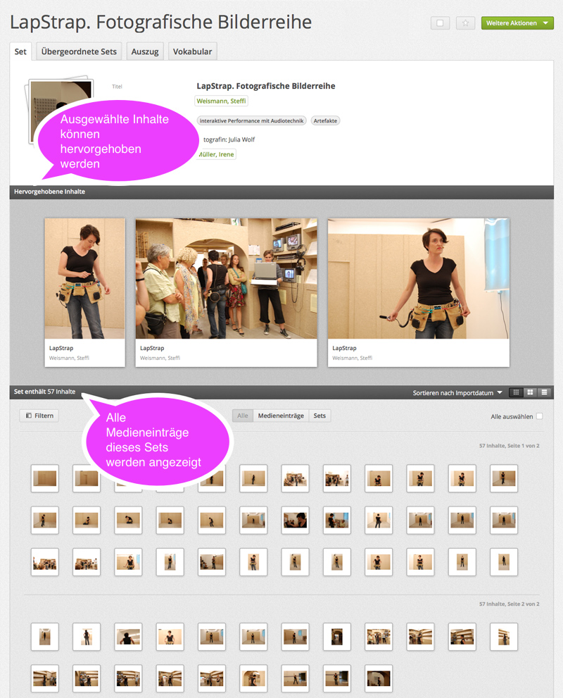
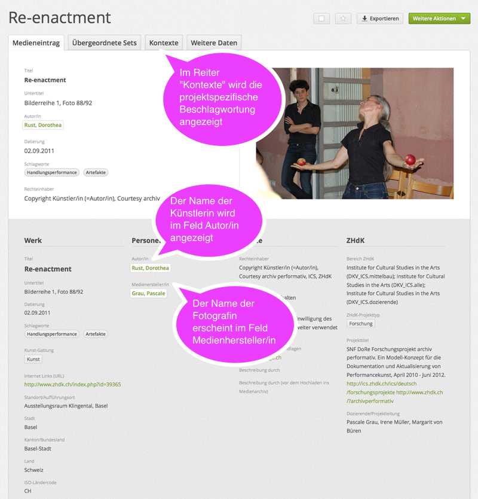
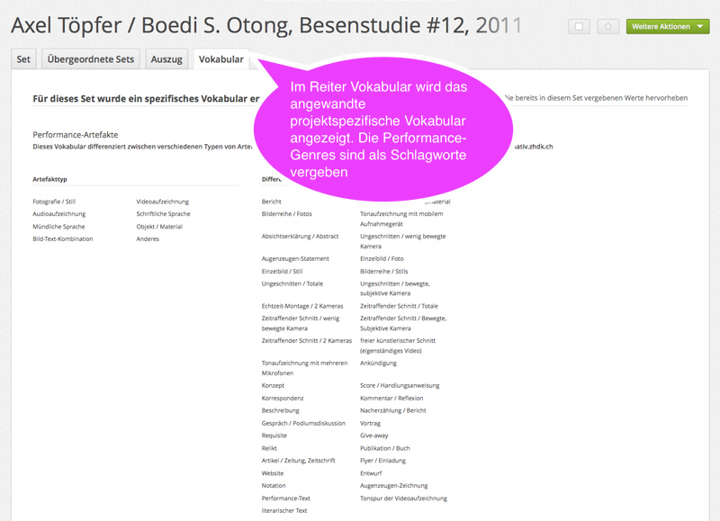

## Dokumentation und Archivierung von Werken der Darstellenden Künste und der Performancekunst

Aufführungen der Darstellenden Künste wie Theater oder Tanz sind ebenso wie die Performancekunst ephemer und an Zeit, Ort und Körper gebunden. Sie folgen einem Drehbuch, einer Choreografie oder einem künstlerischen Konzept und sind orts- und situationsspezifisch. Aufgrund dieser genuinen Eigenschaften stellen sich bei der Dokumentation und Archivierung solcher Aufführungen andere Fragen als bei eher "statischen" Werken der Bildenden Kunst.

Am Beispiel von Performances sollen die Möglichkeiten der Erfassung von ephemeren künstlerischen Werken im Medienarchiv der Künste gezeigt werden. Diese Arbeiten wurden im Rahmen des SNF/DoRe Forschungsprojekts *archiv performativ* am Institute for Cultural Studies in the Arts (ICS) an der ZHdK im Jahr 2011 dokumentiert. Das Projektteam von Pascale Grau (Leitung), Irene Müller und Margarit von Büren untersuchte das wechselseitige Verhältnis zwischen Performancekunst, ihren Archiven und ihrer Tradierung. Die Empfehlungen des Projekts lassen sich auf die grundlegende Frage der Dokumentation im Medienarchiv übertragen. Basierend auf den Forschungsergebnissen wird an dieser Stelle ein vereinfachter Leitfaden in sechs Punkten für das Arbeiten im Medienarchiv mit Werken der Performancekunst oder verwandten Genres angeboten.

### 1. Vielfalt der Werke -- Angemessenheit der Dokumentation

Unterschiedliche künstlerische Praktiken und Arbeiten erfordern unterschiedliche Dokumentationsformen. So ist z.B. eine Audio-Performance im Stadtraum dokumentarisch anders zu erfassen als eine Ballett-Aufführung auf einer Bühne. Insofern können und sollten bei der Dokumentation verschiedene Medien und Formate zum Einsatz kommen. Ausgangspunkt für jede Dokumentation ist jedoch die künstlerische Arbeit, ihre Konzeption, ihr Inhalt und ihre spezifische Umsetzung.

### 2. Vielfalt der Medien -- Facettenreiche Dokumentation

Eine Aufführung kann nicht umfänglich durch einzelne Bilder, Videos oder Tonaufnahmen repräsentiert werden. Eine Kombination verschiedener Medien befördert hingegen die Überlieferung. Neben den herkömmlichen Aufzeichnungsmedien wie Videos und Fotos können z.B. Augenzeugenberichte oder Rezensionen, aber auch Dokumente aus der Entwicklungs- und Konzeptionsphase eine weitere Sicht erschliessen.

<https://medienarchiv.zhdk.ch/sets/8088f581-bf52-42e8-82e4-4bfd317fbeae>

### 3. Überlieferung und Annäherung

Dokumentationen ermöglichen lediglich eine Annäherung an eine vergangene Aufführung. In diesem Sinne sind Fotos oder Videos als Artefakte immer Teil einer Rekonstruktion oder Weiterschreibung einer bereits vergangenen Wirklichkeit und entstammen jeweils einer subjektiven und fragmentarischen Perspektive

### 4. Verschiedene Sichtweisen -- Ergänzung und Gewichtung

Sind mehrere Personen an der Dokumentation beteiligt, entstehen zwangsweise verschiedene Sichtweisen auf eine Aufführung. Zum einen ergänzen sich diese gegenseitig und tragen zu einer polyphonen Überlieferung bei. Zum anderen bedürfen sie einer Gewichtung aus der Sicht der Künstler/innen oder Nutzer/innen. Je nach Rezeptionskontext und Bewertung können diese Artefakte auch eigenständigen Werkcharakter erlangen.

<https://medienarchiv.zhdk.ch/sets/fbeb387f-3e1d-4114-82dc-fcaa2a421ced>

### 5. Offenlegung der Quellen und ihrer Bewertung

Die Produktionsumstände und Autor/innen von Dokumentationen sollten offengelegt werden. Dies einerseits, um die Urheberschaft der jeweiligen Quelle zu benennen und damit anzuerkennen. Andererseits bestehen zwischen explizit beauftragten Dokumentationen und zufälligen, seitens des Publikums erzeugten Aufzeichnungen ein Unterschied, den es in der Rezeption und Analyse zu berücksichtigen gilt. Darüber hinaus gilt es zu unterscheiden zwischen bewertetem und unbewertetem Material. So mag eine geschnittene und kommentierte Videodokumentation ihren Schwerpunkt auf bestimmte Aspekte einer Performance legen und andere vernachlässigen. Hingegen können ungeschnittene Aufzeichnungen ein umfassenderes Bild ergeben und sind für die Künstler/innen und insbesondere für Forschungszwecke besser geeignet.

<https://medienarchiv.zhdk.ch/entries/7bdbc1f8-8d97-45ec-b5f1-74a7b1100ef4>

### 6. Inhaltliche Erschliessung in Datenbanken

Eine konzise inhaltliche Erschliessung erleichtert den Umgang mit Dokumenten in Datenbanken. So wurden für die Medieneinträge des Forschungsprojekts sowohl verschiedene Performance-Genres als auch unterschiedliche Artefakt-Typen für die Beschlagwortung entwickelt. Diese Kategorien beziehen sich explizit auf Performancekunst, andere künstlerische Formen verlangen jeweils nach unterschiedlichen spezifischen Vokabularien.

Für eine vertiefte Beschäftigung mit diesen Fragen verweisen wir auf die Empfehlungen des Forschungsteams *archiv performativ*:

* Eigenschaften von Artefakten  
<http://archivperformativ.zhdk.ch/index.php%3Fid=39381.html>
* Herstellung von Artefakten  
<http://archivperformativ.zhdk.ch/index.php%3Fid=39383.html>
* Fallstudien inkl. Beschreibung von Artefakt-Typen und Liste der Performance-Genres  
<http://archivperformativ.zhdk.ch/index.php%3Fid=39359.html>
