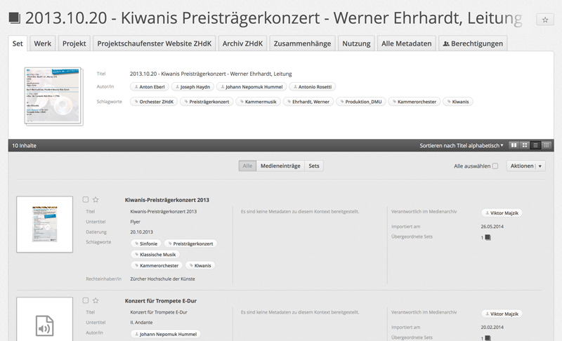
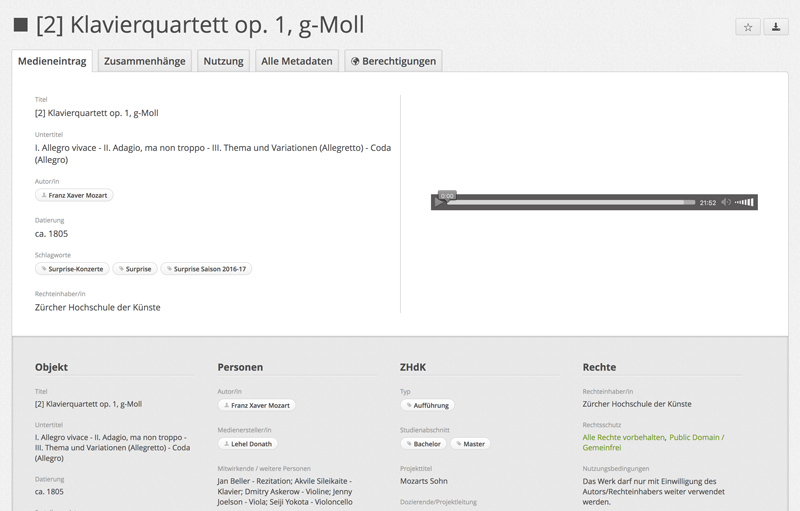

## Archivieren von Musikaufführungen

Im Medienarchiv können die Aufnahmen von musikalischen Veranstaltungen der ZHdK oder andere Musikdateien archiviert und berechtigten Personen zugänglich gemacht werden. Der Musik können noch Informationsmaterial, Flyer, Bilder beigefügt werden.

### Medienmaterial vorbereiten und importieren

Die Medien werden zunächst auf dem eigenen Computer vorbereitet. Dabei werden die Dateien am besten in einem Ordner gesammelt und in das richtige Format gebracht. Für die sichere Langzeitarchivierung empfehlen wir das Dateiformat WAVE/.wav: 48KHz/24bit oder 44.1KHz/16Bit.

[Weitere Informationen zu Medientypen & Dateiformaten](/software/04-mediaentries#medientypen-dateiformate)

Um einzelne Musiktitel entsprechend einem Konzert zu gruppieren, empfiehlt es sich, ein [Set](/software/05-organize#arbeiten-mit-sets) anzulegen und es mit dem Titel der Aufführung zu benennen. Das Set kann vor, während oder nach dem Import angelegt oder ausgewählt werden.

Die vorbereiteten Dateien auswählen und [importieren](/software/04-mediaentries#medien-importieren).

### Metadaten editieren

Metadaten sollten sowohl für das Set als auf die enthaltenen Medieneinträge angegeben werden. Medieneinträge können wahlweise einzeln oder in Gruppen mithilfe der [Stapelverarbeitung](/software/05-organize#stapelverarbeitung) editiert werden. Folgende Metadaten sind für die Musikarchivierung beispielhaft:

#### Werk

* Titel des Stückes
* eventuell Untertitel (z.B. Abschnitt oder Unterteilung des Musikstückes)
* Datierung (des Stückes, Kompositionsjahr)
* Erstellungsdatum (Datum der Aufführung resp. der Tonaufnahme)
* Kunstgattung (Musik)
* Beschreibung (z.B. Flyer-Text)
* Dimension/Dauer des Stückes
* Internet Links

#### Personen

* Autor/in = Komponist
* Medienersteller/in (derjenige, der das Tondokument erstellt bzw. aufnimmt)
* Beteiligte Personen: Interpreten, Regie, Leiter usw.
* Partner/Beteiligte Institutionen (nur bei Koproduktionen)

#### Rechte

* Rechteinhaber: im Normalfall "Zürcher Hochschule der Künste" (ausgeschrieben)

#### ZHdK

* Bereich ZHdK: Studienbereich möglichst genau eingrenzen
* ZHdK Projekttyp: Aufführung, Abschlussarbeit, etc.
* Studienabschnitt: z.B. Master
* Projekttitel: Konzertserie (z.B. Spektrum Konzerte)
* Dozierende: Klasse oder Dozierende als Mitwirkende

### Titelbild für das Set anlegen

Im Aktionsmenü oben rechts haben Sie die Möglichkeit, für das Set ein Titelbild festzulegen. Dieser Schritt macht Sinn, wenn neben Audiodateien auch ein Bild oder Video zur Dokumentation gehört.

[Weitere Informationen zur Set-Gestaltung](/software/05-organize#darstellungsoptionen-von-sets)

### Berechtigungen für Medieneinträge und Sets vergeben

Damit die Musikaufführungen innerhalb der ZHdK zu hören sind, weisen Sie dem Set und den Medieneinträgen die entsprechenden [Zugriffsberechtigungen](/software/04-mediaentries#zugriffsberechtigungen-bearbeiten) zu. Schalten Sie dabei für die Archivierung die Medieneinträge für das *Archiv ZHdK* und für den *Support Medienarchiv der Künste (Madek)* frei.

Die Vergabe von Berechtigungen können Sie wie bei der Bearbeitung der Metadaten per Stapelverarbeitung für alle Medieneinträge zusammen erledigen.

