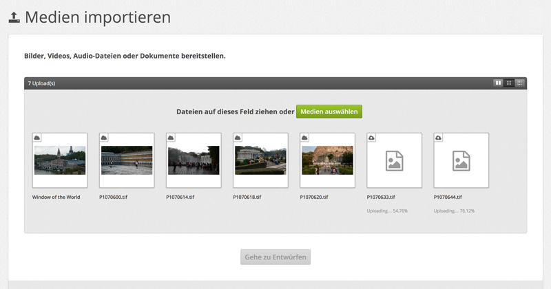
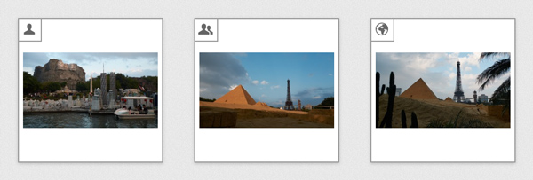
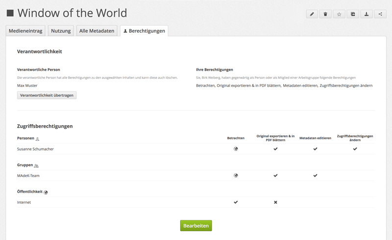

## Arbeiten mit Medieneinträgen

### Medientypen & Dateiformate

Madek unterstützt Bilder, Video, Audio sowie verschiedene Dokumente und erkennt dabei jeweils alle gängigen Formate. In der Praxis empfiehlt es sich aber, sich auf einige wenige Formate zu beschränken, die für die Archivierung von Medien geeignet sind. Für deren Wahl gibt es zwei wesentliche Kriterien: Inhalte sollen in möglichst hoher Qualität abgelegt werden und sie sollen möglichst lange lesbar bleiben. Gerade für die zukünftige Lesbarkeit müssen Empfehlungen spekulativ bleiben. Proprietäre und exotische Formate sollten allerdings nach Möglichkeit vermieden werden. Hinsichtlich der Qualität gilt, dass das Erstellungsformat bereits eine gute Wahl ist. Zusätzliche Konvertierungen fürs Internet sind nicht notwendig, weil Madek diese bei Bedarf selbstständig und entsprechend den aktuellen Anforderungen erstellt.

#### Bilder

Idealerweise sollten Bilder als TIFFs ohne Kompression importiert werden. Falls sie aktuell als PNG oder JPG vorliegen, können auch diese Formate verwendet werden. Photoshop-Dateien werden zwar von der Software verstanden, aber eignen sich aufgrund ihrer Komplexität schlecht als Archivformate.

Bei Bildern ist ausserdem zu beachten, dass eingebettete Metadaten beim Import erkannt und so bestehende Arbeitsabläufe der Bildbearbeitung unterstützt werden.

```
TIFF (ohne Kompression)  
PNG  
JPG
```

#### Video

Bei Videoformaten wird zwischen dem sogenannten Container und den darin enthaltenen Inhalten (zumeist je eine Spur für Video und Audio) unterschieden. Den verwendeten Container erkennt man an der Endung des Dateinamens. Gebräuchliche Formate sind .mov/QuickTime, .mp4/MPEG4 und .mkv/Matroska. Angaben zu Formaten bzw. Codecs der enthaltenen Spuren kann man sehen, wenn man die Dateien in einem Videoplayer öffnet und dort weitere Informationen abruft. Ein verlust- und lizenzfreier Videocodec, der zunehmend von Videoarchiven verwendet wird, ist FFV1. In Kombination mit einer unkomprimierten Tonspur (PCM) und dem ebenfalls offenem Container-Format Matroska wäre nach aktuellem Stand die bestmögliche Formatwahl für Videos. Leider ist die Erstellung einer solchen Datei nicht ganz einfach bzw. wird von den meisten Programmen im Moment noch nicht unterstützt. Eine Alternative hinsichtlich Qualität stellt eine QuickTime-Datei dar mit einer Videospur in Apples ProRes-Codec und einer Tonspur im Apple Lossless Audio Codec (ALAC). Die dritte Option ist eine zwar verlustbehaftete aber dafür gebräuchliche MPEG4-Datei in möglichst hoher Qualität.

```
Matroska/.mkv (Video: FFV1, Audio: PCM, verlustfrei)  
QuickTime/.mov (Video: Apple ProRes, Audio: Apple Lossless, verlustfrei)  
MPEG4/.mp4 (Video: H.264, Audio: AC3, verlustbehaftet)  
```

#### Audio

Audio-Dateien sind im Gegensatz zu Video wesentlich kleiner und deshalb gibt es mit WAV und AIFF seit langem zwei ebenso unkomprimierte wie unkomplizierte Formate, die empfehlenswert sind. Eine Alternative stellt das neuere FLAC-Format mit verlustfreier Komprimierung dar. Nur wenn eine Datei bereits als MP3 vorliegt, ist ein Import in diesem Format vertretbar.

```
WAV (verlustfrei)  
AIFF (verlustfrei)  
FLAC (verlustfrei)  
MP3 (verlustbehaftet)  
```

#### Dokumente

Alle anderen Dateien werden von Madek pauschal als Dokumente betrachtet. Allerdings werden nur PDF-Dateien als solche dargestellt. Der Import anderer Formate ist allenfalls sinnvoll, wenn eine Darstellung nicht notwendig, sondern z.B. Zusatzdateien zu einem Projekt ebenfalls abgelegt werden sollen. Dabei können Sammlungen von Dateien (etwa der Code einer Website oder einer Software) als ZIP importiert werden.

### Medien importieren

Um Medien in Madek importieren zu können, muss man als Nutzer/in angemeldet sein. Zur Import-Seite gelangt man entweder von *Mein Archiv* über die Schaltfläche *Medien importieren* oder von jeder Seite aus über die gleichnamige Option im Nutzer/innen-Menü oben rechts.



Auf der Import-Seite können Dateien wahlweise über die Schaltfläche *Medien auswählen* und den anschliessenden Auswahldialog des Browsers oder mittels über Drag & Drop in die hellgraue Fläche importiert werden. Die Anzahl der Dateien ist dabei nicht beschränkt und sie können auch in mehreren Schritten in das Browser-Fenster gezogen werden. Unter jeder Datei wird der Ladefortschritt angezeigt. Der einzelne Ladevorgang ist beendet, wenn stattdessen der Dateiname erscheint und bei Bilddateien das Bild selbst angezeigt wird. Der Gesamtvorgang ist abgeschlossen, wenn die Schaltfläche *Gehe zu Entwürfen* aktiv bzw. grün wird. Über diese Schaltfläche gelangen Sie zur Seite *Meine Entwürfe*.

Entwürfe sind Medieneinträge, bei denen noch nicht alle Pflichtfelder ausgefüllt sind und die daher der Beschränkung unterliegen, dass sie noch nicht mit anderen Nutzer/innen geteilt werden können. Zu erkennen sind sie an ihrem Wolken-Symbol oben links.

### Metadaten editieren

Um die Metadaten eines Medieneintrags zu bearbeiten, wechselt man in den Editiermodus. Dies geschieht bei der Einzelansicht über die Stift-Schaltfläche im Aktionsmenü oben rechts oder auf Übersichtsseiten in den Rollover-Optionen über das gleiche Symbol.

Die Anordnung der Eingabefelder ist für den Editiermodus optimiert und in verschiedenen Reitern organisiert. Ausgewählte Felder können dabei in mehreren Kontexten erscheinen, soweit dies inhaltlich sinnvoll ist. Einzelne Eingabefelder verfügen zudem über eine Vorschlagsfunktion (Auto-Complete). Zwischen den Reitern können Sie frei wechseln und erst am Ende den Vorgang über die beiden Schaltfläche unten wahlweise bestätigen oder abbrechen. Sollte es sich bei dem bearbeiteten Medieneintrag um einen Entwurf handeln, erhalten Sie anschliessend ausserdem eine Rückmeldung, ob dieser aufgrund der Änderungen zu einem regulären Medieneintrag wurde. Das Bearbeiten der Metadaten von Sets funktioniert analog, auch wenn sich die verfügbaren Felder unterscheiden können.

### Zugriffsberechtigungen bearbeiten

Sobald es sich bei einem Medieneintrag nicht mehr um einen Entwurf handelt, können Zugriffsberechtigungen für ihn vergeben werden. Zugriffsberechtigungen regeln, wer Inhalte sehen, bearbeiten und herunterladen darf. Sie können für einzelne Personen, Gruppen, sogenannte API-Applikationen und die Öffentlichkeit festgelegt werden. Wie öffentlich Medieneinträge und Sets sind, erkennt man auf Übersichtsseiten schnell an den entsprechenden Symbolen oben links: die Einzelperson steht für private Inhalte, mehrere Personen zeigen an, dass andere Nutzer/innen etwas zumindest sehen können und die Weltkugel markiert Inhalte, die öffentlich im Internet sichtbar sind.



Detaillierte Informationen finden Sie in der Einzelansicht unter dem Reiter *Berechtigungen*, wo diese auch bearbeitet werden können. Unterschieden wird dabei neben den Ebenen Personen, Gruppen, API-Applikationen und Öffentlichkeit auch zwischen den Berechtigungen zum "Betrachten", "Original exportieren & in PDF blättern", "Metadaten editieren" sowie "Zugriffsberechtigungen ändern", wobei nicht alle Berechtigungen auf allen Ebenen verfügbar sind. Unabhängig davon gibt es immer eine Person, die die Verantwortlichkeit für einen Medieneintrag hat und diesen damit auch löschen kann. Die Verantwortlichkeit kann hier ebenfalls übertragen werden.



### Exportieren

Um einen Medieneintrag zu Exportieren, benutzen Sie in der Einzelansicht die entsprechende Schaltfläche in der Aktionsmenü oben rechts. Abhängig vom Medientyp stehen dann mehre Formate für zum Download zur Verfügung.


