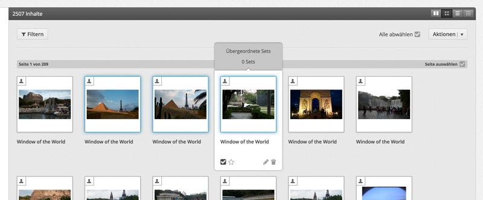
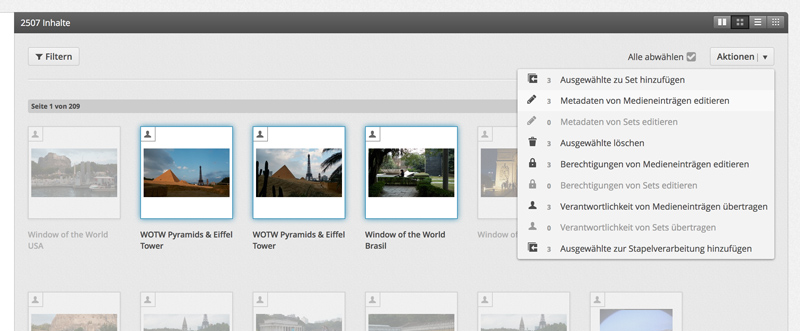
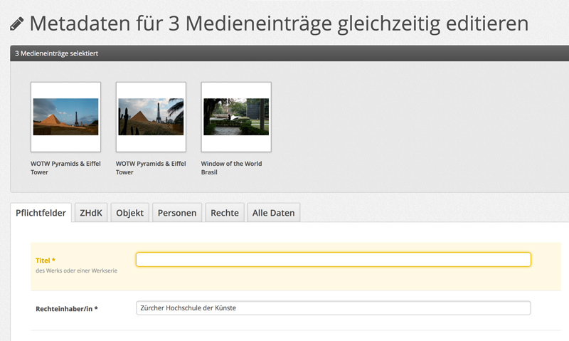
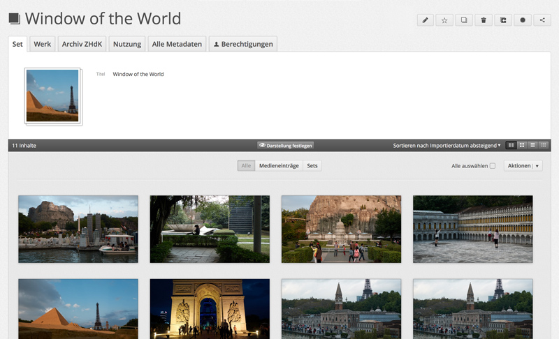
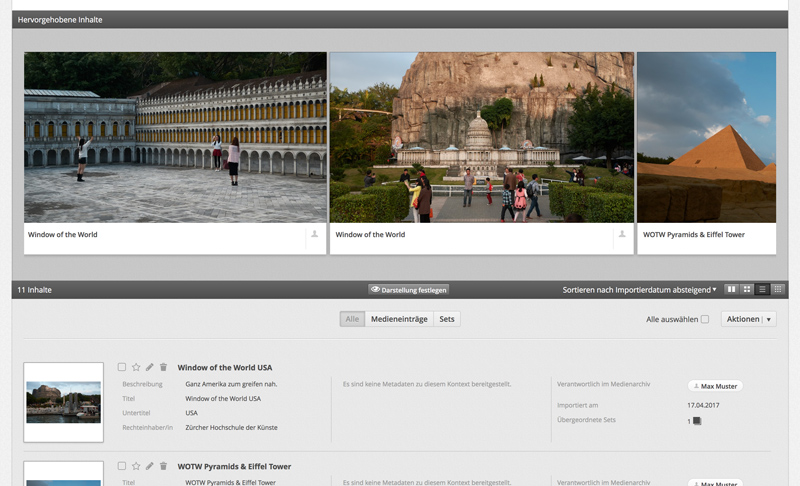
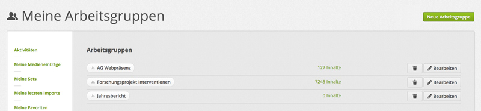

## Ordnen & Vernetzen

Im letzten Kapitel haben wir gesehen, wie einzelne Medieneinträge bearbeitet werden. Hier wird es darum gehen, wie grössere Mengen an Medieneinträge organisiert und Zusammenhänge hergestellt werden können.

### Stapelverarbeitung

Auf Übersichtsseiten mit mehreren Medieneinträgen (z.B. *Meine Medieneinträge*, Set-Ansicht, Suchresultate), lassen sich mehrere Medieneinträge oder Sets auswählen und anschliessend gleichzeitig bearbeiten. Dieser Vorgang wird Stapelverarbeitung genannt. In der Stapelverarbeitung können Metadaten editiert, Zugriffsberechtigungen vergeben und Zusammenhänge hergestellt werden.

#### Auswahl von Medieneinträgen oder Sets

Die Auswahl von Inhalten auf Übersichtsseiten kann wahlweise einzeln oder pauschal erfolgen. Um alle sichtbare Medieneinträge oder Sets auszuwählen, gibt es oben rechts die Schaltfläche *Alle auswählen*. Alternativ kann man mit dem Mauszeiger über die Thumbnails einzelner Inhalte fahren und die dann erscheinende Checkbox unten links anwählen. Ausgewählte Inhalte erhalten in beiden Fällen eine hellblaue Markierung.

#### Stapelfunktion wählen

Die verschiedenen Möglichkeiten, um alle ausgewählten Inhalte zu bearbeiten, finden Sie in der Aktionsleiste oben rechts. Neben jeder Aktion (z.B. Metadaten oder Zugriffsberechtugungen editieren) sehen Sie die Anzahl der betroffenen Medieneinträge oder Sets. Diese kann abweichen von der Anzahl der ausgewählten Inhalte, wenn Sie für eine Aktion nicht in allen Fällen die benötigten Rechte besitzen. Ansonsten entsprechen diese Funktionen den zuvor beschriebenen Aktionen für einzelne Medieneinträge. Zusätzlich gibt es hier die Möglichkeit, ausgewählte Inhalte zur Stapelverarbeitung hinzuzufügen. Dieser Zwischenschritt ist hilfreich, wenn nicht alle zu bearbeitenden Inhalte auf einer Übersichtsseite zu finden und z.B. Suchen nach verschiedenen Schlagworten notwendig sind. In diesem Fall erfolgt die Bearbeitung später mittels der Seite *Stapelverarbeitung* in *Mein Archiv*.

<!-- Fragen: Warum heisst es hier Stapelverarbeitung und nicht Zwischenablage? Warum fehlt die Funktion im User-Menü? -->

#### Metadaten bearbeiten

Bei der Bearbeitung der Metadaten mehrerer Medieneinträge oder Sets kann es vorkommen, dass es bereits unterschiedliche Angaben für ein Eingabefeld gibt. Dies tritt beispielsweise auf, wenn Bilder zuvor mit individuellen Titeln versehen wurden und anschliessend für alle der/dieselbe Rechteinhaber/in ergänzt werden soll. Felder mit unterschiedlichen Angaben sind werden gelb markiert während bei Feldern ohne Markierung die Angaben überall identisch sind. In jedem Fall werden bei bearbeiteten Felder alle bisherigen Angaben überschrieben, während bei Feldern, die nicht bearbeitet werden, die Angaben erhalten bleiben. Im oben skizzierten Fall würde man entsprechend nur den/die Rechteinhaber/in angeben und die individuellen Titel würden erhalten bleiben.

Um unterschiedliche Werte bei allen ausgewählten Inhalten zu löschen, muss zunächst ein temporärer Wert (z.B. das Zeichen "-") angeben und gespeichert werden. In einem zweiten Schritt kann dieser Wert wieder für alle Inhalte gelöscht werden. Liegen bereits einheitlichen Angaben vor, entfällt zum Löschen der erste Schritt und die Werte können direkt entfernt werden.

### Arbeiten mit Sets

Zusammenhänge zwischen Medieneinträgen entstehen automatisch aufgrund der vergebenen Metadaten, etwa wenn mehrere Bilder dieselbe Autorin haben oder mit demselben Schlagwort versehen wurde. Neben dieser offenen Vernetzung (analog zu Hashtags in sozialen Medien) ist es oft sinnvoll, Inhalte in Sets zu gruppieren. Sets funktionieren ähnlich wie Ordner auf dem eigenen Computer, d.h. man kann in ihnen alle zu einem Projekt gehörenden Dateien sammeln, aber auch Sets in Sets legen, wenn man es mit komplexeren Strukturen zu tun hat. Im Gegensatz zur Computer-Dateiablage (oder auch dem physischen Schreibtisch) können Inhalte in Madek jedoch gleichzeitig in mehreren Sets liegen. Konkret wäre das der Fall, wenn man Medieneinträge zunächst in Sets für verschiedene Projekte ablegen und später eine Auswahl von Medieneinträgen aus unterschiedlichen Projekten für einen neuen Verwendungszweck in einem zusätzlichen Set sammelt.

Inhalte können entweder einzeln oder per Stappelverarbeitung zu Sets hinzugefügt oder aus ihnen entfernt werden. Bei einem einzelnen Inhalt geschiet dies über die entsprechende Schaltfläche im Aktionsmenü oben rechts. Bei mehreren Inhalten und Stappelverarbeitung finden Sie diese Funktion in der Aktionsleiste. In beiden Fällen öffnet sich ein Dialog über den bereits exitierende Sets gesucht oder auch ein neues Set erstellt werden kann. Alternativ gibt es in *Mein Archiv* oben rechts die Möglichkeit zunächst nur ein leeres Set zu erstellen, in das später Inhalte gelegt werden können.

Sets verfügen die gleiche Möglichkeit, Zugriffsberechtigungen zu vergeben, und über ähnliche Metadatenfelder, um sie zu beschreiben. Bitte beachten Sie, dass sich weder Zugriffsberechtigungen noch Metadaten von einem Set auf seine Inhalte übertragen. Dies erlaubt ein wesentlich differenziertes Arbeiten, wenn etwa nicht alle Bilder in einem Set öffentlich sichtbar sein sollen, erfordert aber dafür entsprechende Arbeitsschritte auf den unterschiedlichen Ebenen.

### Darstellungsoptionen von Sets

Wie auf allen Übersichtsseiten gibt es auch bei Sets die Möglichkeit, Inhalte auf unterschiedliche Arten anzuzeigen: als Kacheln, im Raster, als Liste oder als Miniaturen. Bei Sets ist es zusätzlich möglich, Inhalte zu sortieren und die gewählte Ansicht und Sortierung als Standardarstellung für ein Set festzulegen. Über das Aktionsmenü gibt es die Möglichkeit, das Titelbild eines Sets festzulegen. Bei Sets mit vielen Inhalten kann es sinnvoll sein, einzelne Inhalte hervorzuheben. Dies beschiet ebenfalls über das Aktionsmenü. Hervorgehobene Inhalte werden dann in einem zusätzlichen Bereich zwischen den allgemeinen Angaben zum Set und der Anzeige aller Inhalte angezeigt.

### Adressen verwalten

Jeder Medieneintrag und jedes Set in Madek verfügt über eine feste Adresse oder URL, die an andere Personen weitergegeben werden kann. Bei Adressen, die für Kommunikationszwecke verwendet werden, kann es sinnvoll sein, diese sprechender zu gestalten. Über die entsprechende Schaltfläche im Aktionsmenü können Sie eine oder mehrere Alternativadressen anlegen. Ein Set ist dann nicht mehr nur über seinen kanonischen Pfad (z.B. `https://www.server.net/sets/3ff67136-38fb-470e-9766-a1196390d289`), sondern auch über eine Alternative wie etwa `https://www.server.net/sets/mein-projekt` zu erreichen. Der Pfad darf dabei keine Leer- und Sonderzeichen enthalten und muss innerhalb der Instanz einmalig sein. Die Verwendung von Namen von Organisationseinheiten (`https://www.server.net/sets/abteilung-abc`) sollte daher diesen vorbehalten bleiben.

### Favoriten

Medieneinträge und Sets, mit denen man regelmässig arbeitet, können über die Stern-Schaltfläche im Aktionsmenü als Favoriten gespeichert (und auch wieder gelöscht) werden. Gesetzte Favoriten findet man wahlweise über die Seitenleiste in *Mein Archiv* oder das Nutzer/innen-Menü oben rechts. Eigene Favoriten sind für andere Nutzer/innen nicht sichtbar.

### Arbeitsgruppen

Die Berechtigung, Inhalte zu sehen und auch zu bearbeiten, können Einzelpersonen und Gruppen gegeben werden. Für das kollaborative Arbeiten stellen Arbeitsgruppen eine wesentliche Erleichterung dar, weil einerseits nicht in jedem Fall alle Nutzer/innen, die Zugriffsberechtigungen erhalten sollen, einzeln angegeben werden müssen und weil bei der veränderten Zusammensetzung einer Arbeitsgruppe Zugriffsberechtigungen nicht neu gesetzt werden müssen.

Arbeitsgruppen können von allen Nutzer/innen auf der Seite *Meine Arbeitsgruppen* (in *Mein Archiv* bzw. im User-Menü) angelegt werden. Fügen sie andere Nutzer/innen hinzu oder löschen sie diese. Grundsätzlich habe alle Mitglieder einer Arbeitsgruppe die Möglichkeit andere Nutzer/innen hinzuzufügen oder zu entfernen.
