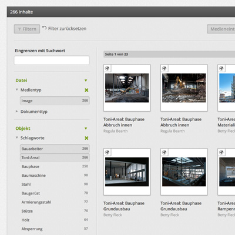

## Erkunden & Suchen

Madek bietet mehrere Möglichkeiten, um Inhalte zu finden. Die einfachste ist die Volltextsuche, die Sie über den entrsprechenden Reiter oben mittig erreichen. Die Suchergebnisse können in unterschiedlichen Darstellungsformen (Raster, Kacheln, Liste, Miniaturen) angeschaut werden.

### Filtern

Auf der linken Seite finden Sie die Möglichkeit, gefundene Inhalte nach verschiedenen Kriterien zu filtern. Dazu gehören einerseits die Unterscheidung nach Medien- und Dokumenttypen und andererseits nach Metadaten wie Autor/in und Schlagworte. Alle Filterkriterien sind frei kombinierbar. Über Zähler neben den jeweiligen Begriffen ist zudem ersichtlich wie viele Inhalte die jeweilige Option ergeben würde. Mittels der Schaltflächen direkt oberhalb der Suchergebnisse kann zwischen Medieneinträgen und Set gewählt werden.

### Vokabulare

Metadaten sind in Madek in thematischen Vokabularen gruppiert, die bei jeder Instanz anders konfiguriert sein können. Neben Vokabularen, die allen Usern zur Verfügung stehen, kann es auch sogenannte Fachvokabulare geben, die ausschliesslich für einzelne Projekte bzw. Arbeitsgruppen gedacht sind. Um zu sehen, welche Vokabulare Ihnen zur Verfügung stehen, gehen Sie wahlweise unter *Mein Archiv* oder *Erkunden* zu *Vokabulare*.